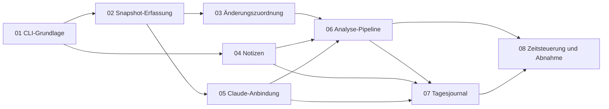

# Umsetzungsplanung IPA Assistant V1

Dieser Ordner enthält die verbindliche Umsetzungsplanung für Version 1 des IPA Assistant. Grundlage ist `IPA_ASSISTANT_KONZEPT.md` (Konzeptversion 1.1) im Repository-Root. Das Konzept bleibt als Referenz unverändert. Wo es von der Planung abweicht, gilt die Planung.

## Dateien

| Datei | Inhalt |
| --- | --- |
| [spec.md](spec.md) | Gemeinsame technische Spezifikation: Umfang, Architektur, CLI, Konfiguration, Datenmodelle, Schnittstellen, Lebenszyklen, Claude-Aufruf, Filter, Regeln, Tests, Klärungsprotokoll |
| [checklist.md](checklist.md) | Übergreifender Fortschritt, Paketstatus und Abnahmematrix zu Konzept §17 |
| `packages/NN-name/spec.md` | Paketspezifikation: Ziel, Umfang, Verhalten, Randfälle, Akzeptanzkriterien `AK-NN-xx`, Tests |
| `packages/NN-name/checklist.md` | Ausführbare Paketcheckliste |
| `packages/NN-name/prompt.md` | Vollständiger Umsetzungsprompt für eine neue Claude-Code-Sitzung |

Gemeinsame Verträge stehen nur in `spec.md`. Die Pakete verweisen darauf (`spec.md §…`) und führen keine abweichenden Kopien.

## Paketübersicht

| Nr. | Paket | Ziel | Hängt ab von | Wichtigster Prüfnachweis |
| --- | --- | --- | --- | --- |
| 01 | [CLI-Grundlage](packages/01-cli-grundlage/spec.md) | Baubares Projekt; `ipa init` und `ipa status`; eigener Arbeitsbereich pro Repository, standardmässig ausserhalb, wahlweise `--workspace`; Core-Bausteine und Git-Leseliste; Claude-Vorabprüfung mit künstlichen Daten | – | Getrennte Arbeitsbereiche mit unverändertem Repository (AK-01-03, AK-01-07, AK-01-15); Vorabprüfung live dokumentiert (AK-01-18) |
| 02 | [Snapshot-Erfassung](packages/02-snapshot-erfassung/spec.md) | Gefilterte, konsistente und atomare Snapshots von Commits, Index, Working Tree und neuen Dateien; Ausgangs-Snapshot bei `init`; `capture` ohne KI | 01 | Künstliches Secret, auch in einer entfernten Diff-Zeile, erscheint nirgends in der Datenwurzel (AK-02-05, AK-02-06) |
| 03 | [Änderungszuordnung](packages/03-aenderungszuordnung/spec.md) | `state_delta`, Statusänderungen statt Doppelerfassung, kein Snapshot ohne Änderung, Halt und `ipa baseline`, Testberichte | 01, 02 | Ein unverändert committeter Stand wird nur als Statusänderung geführt (AK-03-03) |
| 04 | [Notizen](packages/04-notizen/spec.md) | `ipa note` mit Typen, gemessenen oder geschätzten Zeiten und Verzögerungen, ohne Lock und ohne Snapshot-Voraussetzung | 01 | Zeit ohne Angabe von gemessen oder geschätzt wird abgelehnt, die Verzögerung wird separat gespeichert (AK-04-03, AK-04-04) |
| 05 | [Claude-Anbindung](packages/05-claude-anbindung/spec.md) | `ClaudeRunner` ohne Werkzeuge und ohne Shell, Fehlerklassen, `ai-usage.jsonl`, `ipa doctor [--live]` | 01, 02 | Exakte Argumentliste über Fake-CLI; live meldet Claude keine Werkzeuge und keine MCP-Server (AK-05-01, AK-05-09) |
| 06 | [Analyse-Pipeline](packages/06-analyse-pipeline/spec.md) | Eingabepaket, Validierung mit Belegregeln, Work-Logs, Warteschlange, Cursor, Wiederanlauf, `ipa skip`; Referenzprüfung und Secret-Warnung für `ipa note` | 02, 03, 04, 05 | Nach einem Abbruch nach der Abschlussmarkierung wird der Cursor ohne neuen Aufruf und ohne Doppel-Log nachgeführt (AK-06-06) |
| 07 | [Tagesjournal](packages/07-tagesjournal/spec.md) | `ipa journal [--day] [--no-ai]` mit belegten Entwürfen, deterministischer Zeitübersicht und offenen Punkten | 04, 05, 06 | Frühere Entwürfe und die persönliche Endfassung bleiben byte-gleich (AK-07-03) |
| 08 | [Zeitsteuerung und Abnahme](packages/08-zeitsteuerung-und-abnahme/spec.md) | `capture --scheduled`, Laufzeitgrenze, Vorlage für die Windows-Aufgabenplanung, V1-Abnahmeprotokoll mit echtem Claude | 06, 07 | Alle Fälle aus Konzept §17 sind live geprüft und protokolliert (AK-08-08) |

## Abhängigkeiten

Der Graph ist zyklenfrei. Transitive Abhängigkeiten sind in der Tabelle nicht wiederholt. Paket 06 setzt zum Beispiel über Paket 02 auch Paket 01 voraus.

## Empfohlene Reihenfolge

1. **01 CLI-Grundlage**, einschliesslich der Claude-Vorabprüfung. Ihr Ergebnis zeigt früh, ob ein Claude-Update nötig ist.
2. **02 Snapshot-Erfassung**: Danach funktioniert der manuelle technische Prototyp aus Konzept Etappe 1.
3. **03 Änderungszuordnung**
4. **04 Notizen**: Setzt nur 01 voraus. Kann direkt nach 01 umgesetzt werden, damit Notizen früh nutzbar sind.
5. **05 Claude-Anbindung**: Kann auch vor 03 oder 04 umgesetzt werden. Sie überführt die Vorabprüfung aus 01 in `ipa doctor --live`. Die Live-Prüfung AK-05-09 sollte vor Paket 06 erfolgen.
6. **06 Analyse-Pipeline**: Danach funktioniert der vollständige manuelle Ablauf aus Konzept Etappe 2 und 3.
7. **07 Tagesjournal**: entspricht Konzept Etappe 4
8. **08 Zeitsteuerung und Abnahme**: entspricht Konzept Etappe 5, ohne die Messungen während der Probe-IPA

Nach jedem Paket liegt ein lauffähiger, getesteter Zwischenstand vor.

## Arbeit mit den Prompts

1. Eine neue Claude-Code-Sitzung im Repository-Root öffnen.
2. Den Inhalt von `packages/NN-name/prompt.md` als erste Nachricht einfügen.
3. Die Sitzung setzt nur dieses Paket um, aktualisiert Paketcheckliste und zentrale `checklist.md`, fasst zusammen und hält an.
4. Echte Claude-Aufrufe für Live-Prüfungen erfolgen nur nach ausdrücklicher Freigabe in der jeweiligen Sitzung.
5. Klärungen und Abweichungen stehen danach in `spec.md` §18.

Der erste Prompt ist [packages/01-cli-grundlage/prompt.md](packages/01-cli-grundlage/prompt.md).

## Offene Entscheidungen

Die offenen Entscheidungen O-01 bis O-08 stehen in `spec.md` §3.4. Keine davon blockiert den Start. Bis zur Klärung gelten die dort genannten Standardwerte.
